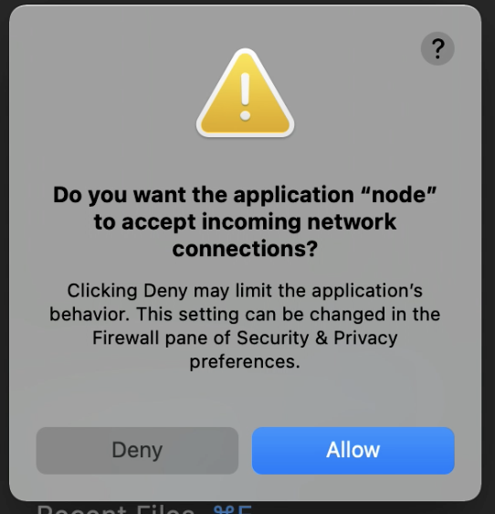

# Demonstration of build problems with Nx >= 11.2

This repository is fork of [nx-incremental-large-repo](https://github.com/nrwl/nx-incremental-large-repo).

There are two problems after migrating to latest version of Nx. Both are related to build.

## Network access

Build is failing due to network access.

To demonstrate this issue, just build the project. 
```
nx affected:build
```

On Mac OS, the following error is produced many times during build: 

 

On Linux, the build is failing with following error:
```
ERROR: Timed out waiting for sync-rpc server to start (it should respond with "pong" when sent "ping"):


events.js:173

      throw er; // Unhandled 'error' event

      ^

Error: connect ECONNREFUSED 127.0.0.1:37683

    at TCPConnectWrap.afterConnect [as oncomplete] (net.js:1054:14)

Emitted 'error' event at:

    at emitErrorNT (internal/streams/destroy.js:91:8)

    at emitErrorAndCloseNT (internal/streams/destroy.js:59:3)

    at processTicksAndRejections (internal/process/task_queues.js:84:9)

```

## ngcc conflict

Another issue is when you use parallel builds:

```
 nx run-many --all --target build --parallel --maxParallel 10
```

During the build, the ngcc conflicts are occuring:
```
(...)

> nx run app0-lib4-childlib8:build [retrieved from cache]
Building Angular Package

------------------------------------------------------------------------------
Building entry point '@largerepo/app0/lib4/childlib8'
------------------------------------------------------------------------------
Bundling to FESM2015

------------------------------------------------------------------------------
Built Angular Package
 - from: /(...)/nx-incremental-large-repo/libs/app0/lib4/childlib8
 - to:   /(...)/nx-incremental-large-repo/dist/libs/app0/lib4/childlib8
------------------------------------------------------------------------------

> nx run app0-lib4-childlib9:build [retrieved from cache]
Building Angular Package

------------------------------------------------------------------------------
Building entry point '@largerepo/app0/lib4/childlib9'
------------------------------------------------------------------------------
Bundling to FESM2015

------------------------------------------------------------------------------
Built Angular Package
 - from: /(...)/nx-incremental-large-repo/libs/app0/lib4/childlib9
 - to:   /(...)/nx-incremental-large-repo/dist/libs/app0/lib4/childlib9
------------------------------------------------------------------------------
Another process, with id 36306, is currently running ngcc.
Waiting up to 250s for it to finish.
(If you are sure no ngcc process is running then you should delete the lock-file at /(...)/nx-incremental-large-repo/node_modules/@angular/compiler-cli/ngcc/__ngcc_lock_file__.)
Another process, with id 36306, is currently running ngcc.
Waiting up to 250s for it to finish.
(If you are sure no ngcc process is running then you should delete the lock-file at /(...)/nx-incremental-large-repo/node_modules/@angular/compiler-cli/ngcc/__ngcc_lock_file__.)
Another process, with id 36306, is currently running ngcc.
Waiting up to 250s for it to finish.
(If you are sure no ngcc process is running then you should delete the lock-file at /(...)/nx-incremental-large-repo/node_modules/@angular/compiler-cli/ngcc/__ngcc_lock_file__.)
Another process, with id 36306, is currently running ngcc.
Waiting up to 250s for it to finish.
(If you are sure no ngcc process is running then you should delete the lock-file at /(...)/nx-incremental-large-repo/node_modules/@angular/compiler-cli/ngcc/__ngcc_lock_file__.)
Another process, with id 36306, is currently running ngcc.
Waiting up to 250s for it to finish.
(If you are sure no ngcc process is running then you should delete the lock-file at /(...)/nx-incremental-large-repo/node_modules/@angular/compiler-cli/ngcc/__ngcc_lock_file__.)
Another process, with id 36306, is currently running ngcc.
Waiting up to 250s for it to finish.
(If you are sure no ngcc process is running then you should delete the lock-file at /(...)/nx-incremental-large-repo/node_modules/@angular/compiler-cli/ngcc/__ngcc_lock_file__.)
Another process, with id 36306, is currently running ngcc.
Waiting up to 250s for it to finish.
(If you are sure no ngcc process is running then you should delete the lock-file at /(...)/nx-incremental-large-repo/node_modules/@angular/compiler-cli/ngcc/__ngcc_lock_file__.)
Another process, with id 36306, is currently running ngcc.
Waiting up to 250s for it to finish.
(If you are sure no ngcc process is running then you should delete the lock-file at /(...)/nx-incremental-large-repo/node_modules/@angular/compiler-cli/ngcc/__ngcc_lock_file__.)
Another process, with id 36310, is currently running ngcc.
Waiting up to 250s for it to finish.
(If you are sure no ngcc process is running then you should delete the lock-file at /(...)/nx-incremental-large-repo/node_modules/@angular/compiler-cli/ngcc/__ngcc_lock_file__.)
Another process, with id 36310, is currently running ngcc.
Waiting up to 250s for it to finish.
(If you are sure no ngcc process is running then you should delete the lock-file at /(...)/nx-incremental-large-repo/node_modules/@angular/compiler-cli/ngcc/__ngcc_lock_file__.)
Another process, with id 36310, is currently running ngcc.
Waiting up to 250s for it to finish.
(If you are sure no ngcc process is running then you should delete the lock-file at /(...)/nx-incremental-large-repo/node_modules/@angular/compiler-cli/ngcc/__ngcc_lock_file__.)
Another process, with id 36310, is currently running ngcc.
Waiting up to 250s for it to finish.
(If you are sure no ngcc process is running then you should delete the lock-file at /(...)/nx-incremental-large-repo/node_modules/@angular/compiler-cli/ngcc/__ngcc_lock_file__.)
Browserslist: caniuse-lite is outdated. Please run the following command: `yarn upgrade`
Another process, with id 36310, is currently running ngcc.
Waiting up to 250s for it to finish.
(If you are sure no ngcc process is running then you should delete the lock-file at /(...)/nx-incremental-large-repo/node_modules/@angular/compiler-cli/ngcc/__ngcc_lock_file__.)
Another process, with id 36310, is currently running ngcc.
Waiting up to 250s for it to finish.
(If you are sure no ngcc process is running then you should delete the lock-file at /(...)/nx-incremental-large-repo/node_modules/@angular/compiler-cli/ngcc/__ngcc_lock_file__.)
Another process, with id 36310, is currently running ngcc.
Waiting up to 250s for it to finish.
(If you are sure no ngcc process is running then you should delete the lock-file at /(...)/nx-incremental-large-repo/node_modules/@angular/compiler-cli/ngcc/__ngcc_lock_file__.)
Another process, with id 36313, is currently running ngcc.
Waiting up to 250s for it to finish.
(If you are sure no ngcc process is running then you should delete the lock-file at /(...)/nx-incremental-large-repo/node_modules/@angular/compiler-cli/ngcc/__ngcc_lock_file__.)
Another process, with id 36313, is currently running ngcc.
Waiting up to 250s for it to finish.
(If you are sure no ngcc process is running then you should delete the lock-file at /(...)/nx-incremental-large-repo/node_modules/@angular/compiler-cli/ngcc/__ngcc_lock_file__.)
Another process, with id 36313, is currently running ngcc.
Waiting up to 250s for it to finish.
(If you are sure no ngcc process is running then you should delete the lock-file at /(...)/nx-incremental-large-repo/node_modules/@angular/compiler-cli/ngcc/__ngcc_lock_file__.)
Another process, with id 36313, is currently running ngcc.
Waiting up to 250s for it to finish.
(If you are sure no ngcc process is running then you should delete the lock-file at /(...)/nx-incremental-large-repo/node_modules/@angular/compiler-cli/ngcc/__ngcc_lock_file__.)
Another process, with id 36313, is currently running ngcc.
Waiting up to 250s for it to finish.
(If you are sure no ngcc process is running then you should delete the lock-file at /(...)/nx-incremental-large-repo/node_modules/@angular/compiler-cli/ngcc/__ngcc_lock_file__.)
Another process, with id 36313, is currently running ngcc.
Waiting up to 250s for it to finish.
(If you are sure no ngcc process is running then you should delete the lock-file at /(...)/nx-incremental-large-repo/node_modules/@angular/compiler-cli/ngcc/__ngcc_lock_file__.)
Another process, with id 36309, is currently running ngcc.
Waiting up to 250s for it to finish.
(If you are sure no ngcc process is running then you should delete the lock-file at /(...)/nx-incremental-large-repo/node_modules/@angular/compiler-cli/ngcc/__ngcc_lock_file__.)
Browserslist: caniuse-lite is outdated. Please run the following command: `yarn upgrade`
Another process, with id 36309, is currently running ngcc.
Waiting up to 250s for it to finish.
(If you are sure no ngcc process is running then you should delete the lock-file at /(...)/nx-incremental-large-repo/node_modules/@angular/compiler-cli/ngcc/__ngcc_lock_file__.)
Another process, with id 36309, is currently running ngcc.
Waiting up to 250s for it to finish.
(If you are sure no ngcc process is running then you should delete the lock-file at /(...)/nx-incremental-large-repo/node_modules/@angular/compiler-cli/ngcc/__ngcc_lock_file__.)
Another process, with id 36309, is currently running ngcc.
Waiting up to 250s for it to finish.
(If you are sure no ngcc process is running then you should delete the lock-file at /(...)/nx-incremental-large-repo/node_modules/@angular/compiler-cli/ngcc/__ngcc_lock_file__.)
Another process, with id 36309, is currently running ngcc.
Waiting up to 250s for it to finish.
(If you are sure no ngcc process is running then you should delete the lock-file at /(...)/nx-incremental-large-repo/node_modules/@angular/compiler-cli/ngcc/__ngcc_lock_file__.)
Another process, with id 36311, is currently running ngcc.
Waiting up to 250s for it to finish.
(If you are sure no ngcc process is running then you should delete the lock-file at /(...)/nx-incremental-large-repo/node_modules/@angular/compiler-cli/ngcc/__ngcc_lock_file__.)
Another process, with id 36311, is currently running ngcc.
Waiting up to 250s for it to finish.
(If you are sure no ngcc process is running then you should delete the lock-file at /(...)/nx-incremental-large-repo/node_modules/@angular/compiler-cli/ngcc/__ngcc_lock_file__.)
Browserslist: caniuse-lite is outdated. Please run the following command: `yarn upgrade`

> nx run app0-lib3-childlib8:build 
Building Angular Package

------------------------------------------------------------------------------
Building entry point '@largerepo/app0/lib3/childlib8'
------------------------------------------------------------------------------
Bundling to FESM2015

------------------------------------------------------------------------------
Built Angular Package
 - from: /(...)/nx-incremental-large-repo/libs/app0/lib3/childlib8
 - to:   /(...)/nx-incremental-large-repo/dist/libs/app0/lib3/childlib8
------------------------------------------------------------------------------
Another process, with id 36311, is currently running ngcc.
Waiting up to 250s for it to finish.
(If you are sure no ngcc process is running then you should delete the lock-file at /(...)/nx-incremental-large-repo/node_modules/@angular/compiler-cli/ngcc/__ngcc_lock_file__.)
Another process, with id 36311, is currently running ngcc.
Waiting up to 250s for it to finish.
(If you are sure no ngcc process is running then you should delete the lock-file at /(...)/nx-incremental-large-repo/node_modules/@angular/compiler-cli/ngcc/__ngcc_lock_file__.)
Another process, with id 36312, is currently running ngcc.
Waiting up to 250s for it to finish.
(If you are sure no ngcc process is running then you should delete the lock-file at /(...)/nx-incremental-large-repo/node_modules/@angular/compiler-cli/ngcc/__ngcc_lock_file__.)
Another process, with id 36312, is currently running ngcc.
Waiting up to 250s for it to finish.
(If you are sure no ngcc process is running then you should delete the lock-file at /(...)/nx-incremental-large-repo/node_modules/@angular/compiler-cli/ngcc/__ngcc_lock_file__.)
Another process, with id 36312, is currently running ngcc.
Waiting up to 250s for it to finish.
(If you are sure no ngcc process is running then you should delete the lock-file at /(...)/nx-incremental-large-repo/node_modules/@angular/compiler-cli/ngcc/__ngcc_lock_file__.)
Browserslist: caniuse-lite is outdated. Please run the following command: `yarn upgrade`

(...)

```
